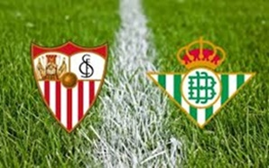

# Ejercicio-2-DGPI
Crear una web y alojarla en GitHub: https://ilopjim.github.io/Ejercicio-2-DGPI/

<!DOCTYPE html>
<html>
    <head>
        <meta charset="utf-8" />
        <link rel="stylesheet" href="style2.css" />
		<link rel="stylesheet" href="fonts.css">
        <title>Ejercicio 2 DGPI</title>
    </head>

    <body>
        

            <header>
                

                    
                    <h1>#derbiSFCvsRBB</h1>
                    
                

                
                <nav>
                    <ul>
						<li><a href="#h1_1">The Game</a></li>
                        <li><a href="#h1_2">Clasificación</a></li>
                        <li><a href="#h1_3">Estadísticas</a></li>
                        <li><a href="#h1_4">Histórico</a></li>
                        
                    </ul>
                </nav>
            </header>
            
			

				<ul>
					<li></li>
					<li></li>
					
				</ul>
			

			
			

				<ul>
					<li></li>
					<li></li>
			
				</ul>
			

			
            

                
                
                
				
            

            
            <section>
                <article>
                    <h1 id="h1_1">Derbi sevillano</h1>
                    
Se conoce por derbi sevillano a los enfrentamientos entre los dos clubes de fútbol principales de Sevilla, Andalucía: el Sevilla Fútbol Club y Real Betis Balompié. Sus disputas a lo largo de la historia lo han convertido en uno de los enfrentamientos más populares y pasionales del fútbol español.

					
A lo largo de su historia se han enfrentado en partidos oficiales correspondientes al Campeonato Regional Sur, la Copa de Sevilla, la Liga española —tanto en Primera como en Segunda División—, en la Copa del Rey, y en Liga Europa —otrora Copa UEFA—, habiendo disputado además numerosos encuentros amistosos.

					
El primer partido oficial entre ambos se produjo el 5 de enero de 1910 en un encuentro válido por la primera edición de la Copa de Sevilla, con un resultado final de empate a cero goles,1​ mientras que los primeros equipos jugaron por primera vez el 28 de noviembre de 1909, saliendo victoriosos los balompédicos.2​ Bien es verdad que, como marcaba la norma, para disputar ese partido el Balompié tuvo que derrotar previamente al tercer equipo y posteriormente al segundo equipo de los sevillistas el 2 de mayo del mismo año.

					
Como particularidad, cabe señalar que son los únicos equipos andaluces que han sido vencedores de las más antiguas y prestigiosas competiciones de España, la Copa del Rey y la Liga, además de encontrarse entre los veinte equipos que han militado en más ocasiones en la Primera División, motivos por lo que son considerados como dos de los clubes históricos del fútbol español.

                    
					
Los antecedentes del derbi sevillano se sitúan en los orígenes de ambos clubes. Nacidos ambos en los primeros años del siglo XX, se empezaron a registrar los primeros conatos de rivalidad en las primeras competiciones regionales andaluzas del Campeonato Regional Sur o la Copa de Sevilla. Precisamente la fecha de fundación de ambos clubes es todavía una de las riñas que mantienen ambos por declararse fundados antes que sus vecinos, habiendo innumerables vías de investigación proclamando diversos datos. Debido a un incendio acontecido en esos primeros años de siglo hizo que gran parte de la documentación oficial de registros de sociedades lúdicas o deportivas —donde debían comparecer los clubes futbolísticos—, así como la escasez de fuentes o informaciones de la época hace que el debate siga patente en la actualidad. Parece que es por ello que ambos constan registrados en 1909 pese a que haya constancia de que ya estaban establecidos con anterioridad,3​ o pudiendo ser efectivamente la fecha de establecimiento legal ya que no lo hicieron previamente. En cualquier caso, intervalos de tiempo tan grandes como desde 1890 a 1909 en caso de los sevillistas y de 1906 a 1914 en el caso bético son los baremos de tiempo que proclaman tanto detractores como defensores de dichas fechas de fundación. 

                
					
Datos aparte, fue en las primeras contiendas del Campeonato de Andalucía y de la Copa de Sevilla donde empezó a forjarse una de las rivalidades más apasionadas del fútbol español.13​14​ Fundamentada en los comienzos por ver cuál de los dos equipos era considerado como el mejor club hispalense y corroborado por dichos torneos regionales, el balance se mantuvo equilibrado hasta los años 1920, fecha en la que los béticos estuvieron al borde de la desaparición por problemas económicos y los sevillistas se convirtieron en los dominadores de la ciudad.

					 
					<h1 id="h1_2">Clasificación</h1>
					<iframe class="clasif"  width=625 height=580 src="clasificacion2.htm"></iframe>
					 
					
					<h1 id="h1_3">Estadísticas</h1>
					<iframe class="estad"  width=625 height=1000 src="estad.htm"></iframe>
					 
					
					<h1 id="h1_4">Histórico</h1>
					<iframe class="historico"  width=625 height=450 src="historico.htm"></iframe>
					 
				</article>
				
                <aside>
                    <h1>CountDown</h1>
                  
                    
                    <object width='100%' height='auto' data='https://aportavalor.com/wp-content/herramientas/cronometro/cronometro.php?f=Jan%206%202018,%2020:45:00&pre=para%20el%20inicio%20del%20partido&pst=Que%20gane%20el%20mejor!!&c=ff0000&b= grey&s=12&r=retro'>No soporta Object</object>
                </aside>
            </section>
            
            
        

    </body>
</html>
